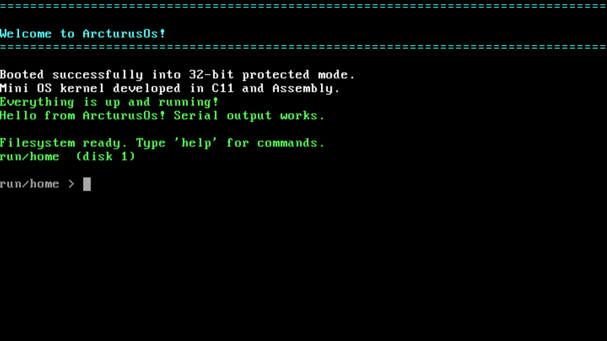

# ArcturusOS

ArcturusOS is a small educational 32-bit x86 operating system kernel written in C11 and Assembly. It boots through the Multiboot protocol, displays output in VGA text mode, and provides a minimal interactive terminal backed by a polling PS/2 keyboard driver.

## Terminal screen


## Features

- Boots in 32-bit protected mode with GRUB/Multiboot support
- VGA text-mode terminal with a hardware cursor
- Serial output through COM1
- Polling PS/2 keyboard input
- Editable terminal input with left and right arrow navigation
- Persistent ATA PIO filesystem backed by `disk.img` in QEMU
- Automatic disk mounts: `run/home`, `run/media`, `run/var`, then `run/var_4`
- Built-in commands:
  - `time` — displays the current CMOS RTC time as `HH:MM:SS`
  - `uptime` — displays elapsed time since the kernel booted
  - `mkdir`, `touch`, `cd`, and `ls` — basic relative-path filesystem navigation
    and creation, starting in `/run/home`
  - `write` — Writes text to a file, usage: write ~/text.txt >> "Hello ArcturusOs".

## Build

The project requires a 32-bit-capable GCC toolchain, GNU assembler, and GNU Make.

```sh
make
```

This produces `arcturus.bin`.

## Run

Run the kernel directly in QEMU:

```sh
make run
```

`make run` creates a 16 MiB `disk.img` on first use and attaches it as the
primary IDE disk. The kernel formats it as its small native filesystem once;
subsequent launches retain files. Attach further IDE disks in QEMU to mount
them in discovery order as `run/media`, `run/var`, and `run/var_4`. A detected
USB flash drive is represented by the removable mount `run/exdrive`; its
controller driver is not present in this polling IDE implementation yet.

To build a bootable ISO instead, install `grub-mkrescue` and run:

```sh
make iso
make run-iso
```

## License

ArcturusOS is free software licensed under the
GNU General Public License version 3 or later.

See [LICENSE](LICENSE) for the full license text.

## Project layout

- `boot.s` — Multiboot header and kernel entry point
- `kernel/` — kernel initialization and terminal input loop
- `terminal/` — VGA terminal and command implementations
- `drivers/` — low-level I/O and PS/2 keyboard driver
- `linker.ld` — kernel linker script

## Notes

This is a freestanding kernel: it does not use a host operating system, standard C library, memory manager, scheduler, or interrupt-driven input yet. It is intended as a compact foundation for learning OS development.
